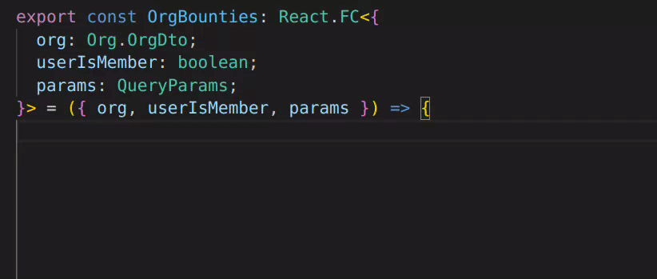

# 𝕏tRPC


A CLI tool that helps you cleanly e𝕏port your tRPC router to

- 🔥🚀 massively boost your language server performance
- 💻😊 give your users a typed SDK so they can consume your API without hassle
- 🫗❌ ensure you don't leak any implementation details via `ctx`
- ✂️🌳 prune your router to expose only the routes you (or your users) care about

𝕏tRPC leverages the awesome [ts-morph](https://github.com/dsherret/ts-morph) API to load, transform & emit the Typescript AST containing your tRPC definitions. Basically, it

1. (in-memory) redefines your `Context` type as `any`
2. (in-memory) "unimplements" your middlewares by transforming them into `({ ctx, next }) => next({ ctx })`
3. (in-memory) prunes your router based on your needs
4. emits a minimal `.d.ts` file that declares your API

With the help of a type assertion, your app stays fully typesafe while you enjoy the performance benefits in your editor!

# Demo

## Performance

Compare how long it takes to write the same tRPC query with the help of Intellisense before and after compiling your API with 𝕏tRPC:

| Before (45s) | After (10s) |
|---|---|
|  |  |

## Typed SDK

See [algora-io/sdk](https://github.com/algora-io/sdk) as an example of how we published our own API

# Table of Contents

- [𝕏tRPC](#𝕏trpc)
- [Demo](#demo)
  - [Performance](#performance)
  - [Typed SDK](#typed-sdk)
- [Table of Contents](#table-of-contents)
- [Quickstart](#quickstart)
  - [Setup](#setup)
      - [Install the package](#install-the-package)
      - [Generate your API](#generate-your-api)
      - [Include your `types` in `tsconfig.json`](#include-your-types-in-tsconfigjson)
      - [Export your API \& inference helpers](#export-your-api--inference-helpers)
      - [(Recommended) Add a type assertion to maintain type safety](#recommended-add-a-type-assertion-to-maintain-type-safety)
      - [Use `API` instead of `AppRouter` in your tRPC client](#use-api-instead-of-approuter-in-your-trpc-client)
  - [Usage](#usage)
- [Configuration](#configuration)
- [Caveats](#caveats)


# Quickstart

## Setup

#### Install the package
Navigate to the project containing your tRPC router and run
```bash
pnpm add -D @algora/xtrpc
```

#### Generate your API
```bash
pnpm xtrpc
```

#### Include your `types` in `tsconfig.json`
```json
{
  "include": ["index.ts", "src", "types"]
}
```

#### Export your API & inference helpers
```ts
export { type API } from "./types/api";
export type RouterInputs = inferRouterInputs<API>;
export type RouterOutputs = inferRouterOutputs<API>;
```

#### (Recommended) Add a type assertion to maintain type safety
```ts
type Expect<T extends true> = T;
type _Assertion = Expect<AppRouter extends API ? true : false>;
```

#### Use `API` instead of `AppRouter` in your tRPC client
```ts
export const trpc = createTRPCNext<API>({...})
```

## Usage

Once you've set up your client to use the API, just rerun the tool to regenerate it whenever your [type assertion](#recommended-add-a-type-assertion-to-maintain-type-safety) fails
```bash
pnpm xtrpc
```

# Configuration

Add a `xtrpc.config.json` file in your project to configure 𝕏tRPC. Below is the default configuration.

```js
{
  // path to the project that contains your tRPC definitions
  "srcProject": ".",

  // path to the project that your API will be exported to
  "dstProject": ".",
  
  // name of the directory your API will be exported to
  "outDir": "types",
  
  // name of the file your API will be exported to
  "outName": "api.d.ts",
  
  // whether your API should be overwritten if it already exists
  "overwrite": false,
  
  // an optional Record<string, string[]> if you'd like to prune your router before exporting
  // keys are subrouters (i.e. the exported name of your subrouter)
  // values are procedures (i.e. the keys of your subrouter)
  "include": {}

  "parserOptions": {
    // type alias of your app router
    "appRouterAlias": "AppRouter"
  }
}
```

# Caveats

- 𝕏tRPC may not work properly if your procedure outputs are not explicitly declared. For best results, add `.output` to all of your procedures (which is a good practice to not leak sensitive info anyways) and enable `explicitOutputs` in your `xtrpc.config.json`
- "Go to definition" jumps to the emitted `.d.ts` file instead of your source code. This can potentially be fixed by emitting declaration map(s) alongside your API.